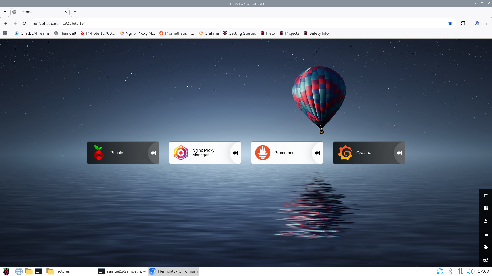
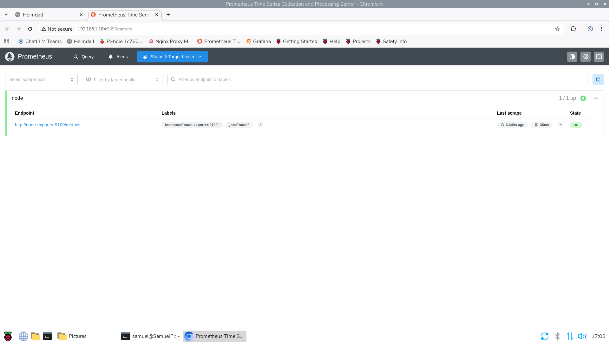
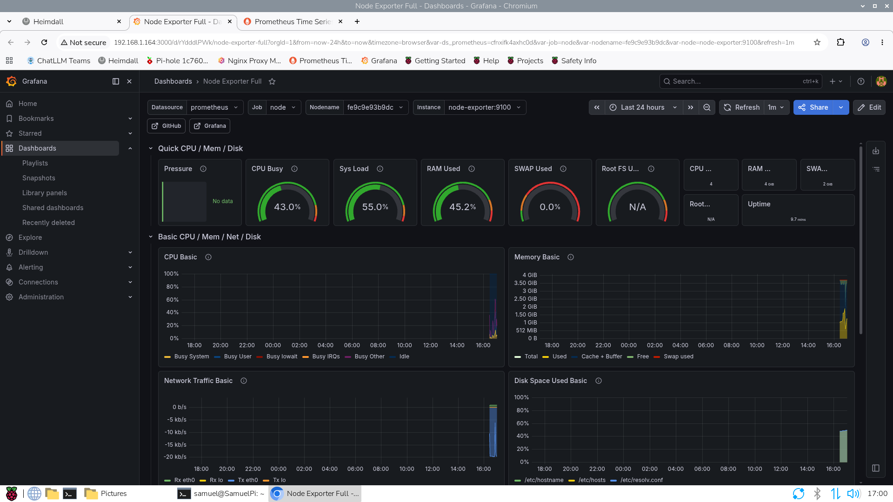
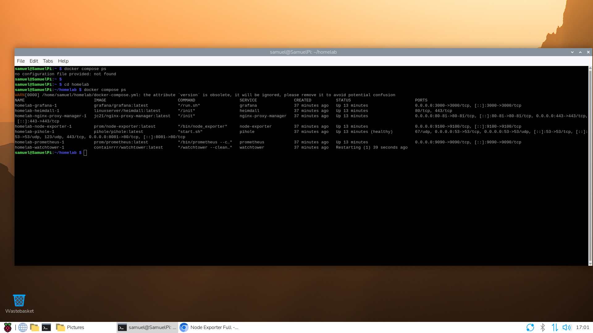

# raspberry-pi-monitoring-lab
Monitoring lab on Raspberry Pi using Prometheus, Node Exporter and Grafana.

# Raspberry Pi Monitoring Lab

Ett övervakningsprojekt där jag byggde en containerbaserad monitoring-miljö på Raspberry Pi. Projektet samlar in och visualiserar systemdata för CPU, minne, lagring och nätverk i realtid.

## Tekniker

- Raspberry Pi 4
- Linux
- Docker
- Docker Compose
- Prometheus
- Node Exporter
- Grafana

## Funktioner

- Node Exporter samlar in systemdata från Raspberry Pi.
- Prometheus hämtar och lagrar mätdata från Node Exporter var 5:e sekund.
- Grafana visualiserar data i realtidsdashboards (CPU, RAM, disk, nätverk).
- Integrerat med samma homelab-infrastruktur som körs via Heimdall och Nginx Proxy Manager.

## Screenshots

### Heimdall Dashboard

### Prometheus Targets

### Grafana Dashboard

### Docker-containrar

## Vad jag lärde mig

- Grundläggande observability och systemövervakning.
- Konfiguration av Prometheus scrape targets.
- Insamling av systemmätdata med Node Exporter.
- Visualisering av driftdata i Grafana med färdiga dashboards.
- Driftsättning och felsökning av containerbaserade tjänster i ett delat Docker-nätverk.

## Säkerhet

Riktiga lösenord och privata konfigurationsvärden lagras inte i repot.
